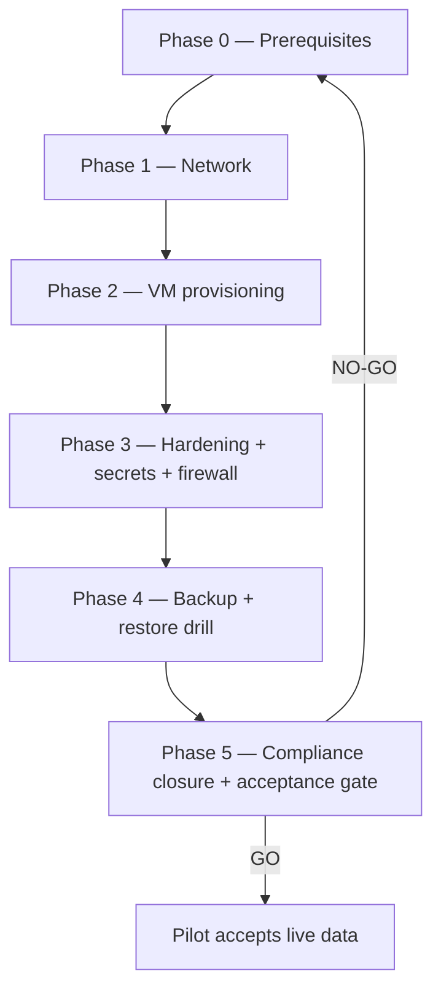

# JOL Pilot Lithuania — Execution Plan (prox01)

> **Status**: FIXED & VERIFIED — consolidated from Steps 1–5 with all
> reconciliation corrections applied. This plan CHANGES NOTHING by itself;
> every phase executes under the CC8.1 package
> (`docs/compliance/change-control-cc81.md`).
> **Date**: 2026-08-23
> **Compliance**: SOC 2 Type II / GDPR (Art. 9, 17, 28, 32, 35) /
> ISO 27001:2022.
> **Gate authority**: `docs/runbooks/jol-pilot-acceptance-gate.md`
> (NO-GO on any FAIL or unjustified UNVERIFIED).

## 1. Design baseline (verified sources)

| Concern | Source of truth | Verified status |
|---------|-----------------|-----------------|
| Capacity & 5-VM topology (VMIDs 200–204) | `docs/servers/prox01-capacity-baseline.md`, `docs/architecture/jol-pilot-vm-topology.md` | DRAFT — host CPU/RAM ⚠ UNVERIFIED (`racadm hwinventory` / `lscpu`) |
| Network: single vlan-aware trunk on nic1 (pvid 60 + tagged 40/45), VLAN 30 excluded | `docs/network/prox01-vmbr-layout.md` | DRAFT — VLAN 45 gated on ADR-004 amendment |
| Default-deny firewall matrix + §3.1 ADR-flagged flow table | `docs/security/jol-pilot-firewall-matrix.md` | DRAFT — app port 8080 ⚠ UNVERIFIED (jol-backend-platform contract) |
| Provisioning specs ×5 (Ubuntu 24.04, jol-admin SSH, Vaultwarden, pool-encryption gate) | `docs/servers/jol-{app,db,bitrix,ingress,observ}-pilot-lt01.md` | SPEC — template not yet on prox01 |
| Backup/DR: vzdump→PBS, staggered 02:15–03:15 UTC, DB priority 1, restore gate | `docs/runbooks/jol-pilot-backup-plan.md` | DRAFT — activates at provisioning |
| Compliance: DPIA MANDATORY (3/9 WP248), CC8.1 package, Art. 17 register | `docs/compliance/{dpia-trigger-check,change-control-cc81,erasure-log}.md` | Trigger DECIDED; DPIA document itself OPEN |

## 2. Phases

### Phase 0 — Prerequisites (blocking)

Entry: CC8.1 issue `[CC8.1] prox01 JOL Pilot Lithuania Deployment — Steps 1-5`
open (labels `change-control`, `soc2`, `infrastructure`, `pilot`), rollback
plan recorded, Proxmox snapshot discipline armed.

| # | Action | Evidence | Rollback |
|---|--------|----------|----------|
| 0.1 | Record host CPU/RAM (`racadm hwinventory`, `lscpu`) in `docs/servers/prox01.md`; re-compute allocation ratio; if 64 GB → apply ARC 8 GB cap or LXC conversion of 203+204 (capacity baseline §3) | updated prox01.md + baseline promotion from DRAFT | n/a (read-only) |
| 0.2 | Merge **ADR-004 amendment** (VLAN 45 / 10.45.45.0/24, defines the single permitted 45→40 flow) | merge commit | revert merge |
| 0.3 | Track/decide **ADR-00x** (Bitrix 40→WAN allowlisted egress) and **ADR-00y** (ingress dual-homing + Loki push-vs-pull direction) | ADR files | n/a |
| 0.4 | Create `data` pool: raidz2, 6× 1.92 TB, **`encryption=on` (aes-256-gcm) at creation — not retrofittable**, `compression=zstd` | `zfs get encryption data` = `aes-256-gcm` | `zpool destroy data` (empty) |
| 0.5 | Upload `ubuntu-24.04-lts-generic-amd64.qcow2` to prox01 `local`; SHA256 vs Canonical checksum | checksum match in CC8.1 issue | delete template |
| 0.6 | Ansible: add `pilot` inventory group + extend `harden-ai-hosts.yml` hosts line (reviewed change; no secret values in inventory) | merged PR | revert |
| 0.7 | Close DPIA actions #1–#2 (full DPIA + Bitrix24 Art. 28 DPA, hosting-region confirmation) | compliance file refs | n/a — blocks go-live, not build |

Exit: acceptance gate §0.1–0.8 all closable.

### Phase 1 — Network

| # | Action | Evidence | Rollback |
|---|--------|----------|----------|
| 1.1 | N2048: create VLAN 45; Gi1/0/11 access→general (pvid 60, tagged 40+45); port-security decision for multi-MAC trunk recorded (⚠ UNVERIFIED fw 6.7.1.24 behaviour — decided BEFORE applying) | pre-change config backup; `show interface gi1/0/11 switchport` | restore saved config (access VLAN 60) |
| 1.2 | MikroTik: VLAN 45 SVI + inter-VLAN rules #1–#7 (matrix §3), default deny | config export backup; rule listing | remove SVI + rules (additive) |
| 1.3 | prox01: apply vlan-aware vmbr0 config (`.bak.<timestamp>` before edit; `ifreload -a`) | `ip -br a`; vmbr layout doc §2 | restore `.bak` + `ifreload -a` |

Exit: host reaches gateway on VLAN 60; tagged VLANs visible; no MAC-flap alarms.

### Phase 2 — VM provisioning (VMIDs 200–204)

Per VM, in dependency order **201 → 200 → 202 → 204 → 203** (DB first;
ingress last — it depends on the DMZ being live):

1. Cloud-init from SHA256-verified template — user-data carries hostname +
   jol-admin key ONLY (secrets NEVER in cloud-init).
2. Config per spec: q35/OVMF, virtio-scsi-single + iothread, cpu=host, qga
   on; **balloon=0 on 201**; `volblocksize=16K` on 201's disk; 203
   dual-NIC (tag 45 + tag 40); static IPs per topology D3.
3. Immediately after first boot: `qm snapshot <vmid> pre-pilot-deploy-<YYYYMMDD-HHMM>`.

Evidence: `evidence/vm<vmid>-provision-*.log` (tee'd, stdout). Rollback:
`qm destroy <vmid> --purge` (fresh guests have no external dependents).

### Phase 3 — Hardening, secrets, firewall

1. `ansible-playbook playbooks/harden-ai-hosts.yml --limit pilot`
   (roles: common, time_sync, ssh, base_firewall, monitoring; backup_client
   only if guest-push decided).
2. Per-VM extras from Step 3 specs (PG controls on 201 incl.
   `log_disconnections=on` + TLS; HTTP jails on 203; AIDE via `aideinit`).
3. Secrets: Ansible Vault for static, Vaultwarden for dynamic; files
   `0640 root:<svc-group>`, world bits 0, auditd `-k jol_secrets` watches.
4. UFW per matrix §2 + negative tests (matrix §5) + §3.1 flows proven.

Evidence: Step-3 D5 checklists per VM → `evidence/vm<vmid>-audit-*.txt`.
Rollback: `qm rollback <vmid> pre-pilot-deploy-<ts>`.

### Phase 4 — Backup & restore drill

1. pbs01 datastore `pilot-lt`; retention 7d/4w/6m; encryption key escrowed
   in Vaultwarden as **`pbs01-pilot-encryption-key`** (verified at gate).
2. `jobs.cfg` nightly jobs 02:15/02:30/02:45/03:00/03:15 UTC (DB priority 1).
3. **Restore drill**: VM 201 (and 200) → VMID 299, network-disconnected;
   boot + `pg_isready`/health + AIDE; cleanup `qm destroy 299 --purge`.
   **Gate rule: drill FAIL ⇒ NO-GO.**

Evidence: `evidence/restore-test-<vmid>-<YYYYMMDD>.log`.

### Phase 5 — Compliance closure & acceptance gate

1. Erasure register live (`docs/compliance/erasure-log.md`): `deleted_at`
   logical deletion + scheduled hard-purge; restore-replay obligation wired
   into the restore runbook; Privacy Notice declares the backup residual.
2. Execute `docs/runbooks/jol-pilot-acceptance-gate.md` §0–§6; assemble the
   sealed evidence package (`INDEX.md` + `SHA256SUMS`).
3. GO ⇒ pilot accepts live personal data; CHANGELOG go-live row written
   (table format, evidence must exist when cited); CC8.1 issue closed.

## 3. Corrections register ("fixed")

All defects found and corrected across the planning series — none carried
into execution:

| Area | Defect corrected |
|------|------------------|
| Network | Draft subnets 10.60.30.x/10.60.40.x nonexistent → fleet scheme; ingress removed from air-gapped VLAN 30; VLAN 50 rejected (Marketplace segregation) → new VLAN 45 |
| Addressing | DHCP→static per fleet convention; free IPs verified against fleet docs (10.40.40.20–.23, 10.60.60.30, 10.45.45.10) |
| Storage | DB moved off capacity-constrained rpool → encrypted raidz2; pool encryption mandated at creation; rpool residual risk for 203 documented with compensations |
| Guest standard | Debian 12 → Ubuntu 24.04 LTS; AllowUsers ansible → jol-admin; HashiCorp Vault removed (Vaultwarden only); secret perms 0600/root:ansible → 0640 root:<svc-group> |
| Backup | Guest-push → hypervisor vzdump; LT → UTC staggered schedules; network-disconnected restore; `deleted_at` erasure + restore-replay |
| Audit hygiene | Fabricated log paths/expected outputs replaced (`pvesh` tasks, `Default: deny` policy line, `aes-256-gcm`); CHANGELOG table format enforced; no future-evidence citations |

## 4. Open risks / Tracked items / Next step

- **Open risks**: host RAM unknown (64 GB ⇒ ARC cap or LXC path); N2048
  multi-MAC trunk behaviour untested (fw 6.7.1.24); single PBS target;
  RB5009 SPOF (G6); app port 8080 unconfirmed; Bitrix hosting region
  unresolved (DPIA action #2).
- **Tracked items**: bastion vs admin01 reuse; `env=pilot` naming approval;
  PCI-DSS scoping if donations enter scope; DB PITR/WAL; proxy choice
  (Traefik vs Nginx); observability stack pins.
- **Next step**: open the CC8.1 GitHub issue, then execute Phase 0.

## Change History

| Date | Change | Evidence |
|------|--------|----------|
| 2026-08-23 | Execution plan consolidated from Steps 1–5 (fixed & verified) | Steps 1–5 artifacts; reconciliation Change History rows therein |
