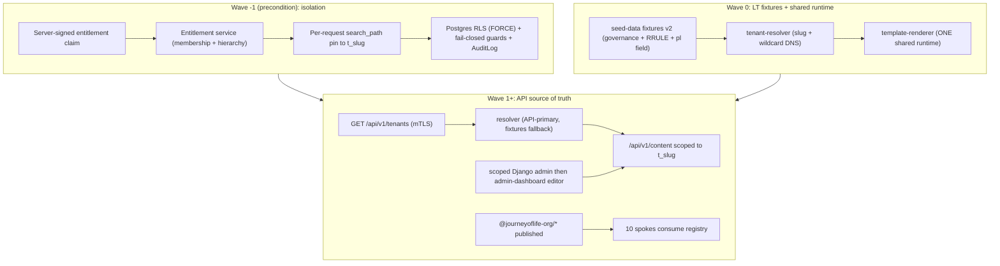

# Design — Basilica Multi-Tenant Content Source of Truth & Tenant Isolation (A3, Security-Gated)

**Date:** 2026-09-21
**Target:** `jol-hub` (frontend `packages/*` + `apps/template-renderer` + `apps/admin-dashboard`; backend `backend/django`), `jol-deploy` (`tenants/*`, `deployment/*`), `jol-backend-platform` (retirement), `AGENTS.md` ecosystem map
**Author:** Principal Platform Architect (Qoder agent)
**Status:** Approved by owner — Q2 = A3 (staged hybrid, security-gated); §1/§2/§3 and all sub-decisions locked. Pending owner review of this document.
**Change class:** Application architecture + tenant data isolation + deploy topology. Multi-repo. GDPR Art. 9 special-category (religious affiliation); SOC 2 Type II CC6/CC7/CC8; ISO 27001:2022 A.5.34/A.8.x; PCI-DSS SAQ-A boundary stays CLOSED (ADR-009 Model A). No PSP surface touched.

---

## 1. Verified starting state

All facts read from the live repos during design, not assumed. Governance ground truth: `jol-hub/docs/decisions/ADR-001`, `ADR-011`; `jol-infrastructure/AGENTS.md`.

| Fact | Evidence |
|---|---|
| `jol-backend-platform` is empty | only `.git/`, `.gitignore`, `LICENSE`, `README.md` (0.2 KB) |
| The real backend is `jol-hub/backend/django` (Django 6.0.3 + DRF 3.16) | `backend/django/requirements.txt`; 37 migrations across 12 apps |
| Content API exists + is mounted | `apps/content/{models,views,serializers,urls,admin}.py`; `core/urls.py:56` `/api/v1/content/` |
| `Page` is tenant-scoped, multi-language | `content/models.py:25-85` (`organization` FK, `language`, `unique_together (organization, slug, language)`, soft-delete) |
| Tenant model is mature | `organizations/models.py` (14 org types incl. `basilica`; `compliance_level`; `sacramental_data_processing` Art. 9(2)(d); `legal_hold` Art. 17(3); 4-tier `parent_diocese`; `Website`; `ConsentSettings`) |
| Per-country config modeled | `countries/models.py` (`gdpr_consent_age`, `supervisory_authority`, `vat_rate`, `default_language`, `timezone`; "27 EU countries") |
| Audit log with DSR + checksum exists | `core/models.py:69-231` (`AuditLog`, Art. 15-21 actions, SHA-256 `checksum`) |
| Tenant middleware exists | `crm/middleware.py` (`TenantContextMiddleware`, registered `base.py:125`) |
| **ADR-001 = schema-per-tenant + RLS**, rejected shared-schema+tenant_id | `ADR-001:16-23,42-43`; Accepted 2026-08-24 |
| **ADR-011 = hub-and-spoke**, 12 `@journeyoflife-org/*` packages, 10 spokes, template-renderer serves 32 tenants | `ADR-011:23-25,60-110`; Accepted 2026-09-11 (D-062) |
| Fixtures = rollback SoT; template-renderer = fallback renderer | `ADR-011` Annex D |
| Ratified scale | ADR-001 "~1,300 LT … ~400,000 EU"; owner horizon ~1,200 LT |
| Resolver = the "spine" | `tenant-resolver/src/index.ts:1-21,112-154` (exact-domain → subdomain-slug → x-tenant; async stub for API fallback) |
| `pl` is frontend-blocked, backend-ready | `i18n/src/config.ts:62-100` (hardcoded `(lt\|ru\|en)`, LT-only hreflang, `FALLBACK_ORDER ['ru','en','lt']`); backend `base.py:208-229` `LANGUAGES` includes `pl` (and omits `ru`); `jol-deploy` schema country enum includes `pl` |
| Fixture schema is lt/en/ru, no recurrence, no governance | `seed-data/src/schema.ts:20-24,147-163,323-339`; clergy names forbidden in fixtures (`:216-220`) |
| Packages already renamed to `@journeyoflife-org/*` | all 12 `packages/*/package.json` named `@journeyoflife-org/*` (pre-flight verified); `.npmrc` scopes `@journeyoflife-org`; publishable-shaped (`tsup`/`dist`/`files`/`publishConfig`) |
| Deploy is per-tenant VM today | `jol-deploy/tenants/lt/basilica-vilnius.yml:12-36` (`vm:{host,ip,port}`, 512M/10G/1cpu) |
| Deploy/rollback tooling exists | `jol-deploy/deployment/{controllers,strategies,rollout,rollback}/*` |
| Bitrix24 = CRM, not CMS | `jol-bitrix24-integration/README.md:3,26`; `countries/lt/config/bitrix24.yml` (crm/calendar/tasks/sale; sacramental_records) |

---

## 2. Decision register (locked)

| # | Decision | Rationale / anchor |
|---|---|---|
| D1 | **Q2 = A3 staged hybrid, security-gated** | Fixtures now (auditable, no runtime leak) → API later; matches ADR-011 Annex D dual-mode |
| D2 | Canonical backend = `jol-hub/backend/django`; **retire `jol-backend-platform`** (archive + pointer README + ecosystem-map update) | Empty repo; real code in hub; AGENTS.md Dependency Rule 1 |
| D3 | **Bitrix24 = CRM only**; website content SoT = Django `content` app | `jol-bitrix24-integration` scope = `crm` |
| D4 | Scale target **~1,200–1,300 LT**, shared-runtime topology A; **"167" retired** (unsourced); current pilot **32** | ADR-001/ADR-011; no artifact contains 167 |
| D5 | **Isolation = schema-per-tenant (`t_<slug>`, `search_path` pinned) + RLS defense-in-depth** | ADR-001 (honoured, not amended) |
| D6 | Cross-tenant response = **404 no-enumeration** | `seed-data/registry.ts:7-9`; SOC 2 CC6.1 |
| D7 | Tenant identity = **server-signed entitlement claim + membership/hierarchy validation**; `X-Tenant-ID` demoted to selector-within-entitled-set | Fixes impersonation (C2) |
| D8 | **Define diocese→deanery→parish hierarchy entitlement now** | ~1,300 will have hierarchical admins |
| D9 | **Add `GET /api/v1/tenants`** (server-to-server, no enumeration) | Resolver contract `registry.ts:8-11` |
| D10 | Canonical tenant URL **`<slug>.gyvenimo-kelias.lt` + wildcard DNS** | Fixes F16; resolver-compatible |
| D11 | **Package scope `@journeyoflife-org/*`** (pre-flight: already complete) | ADR-011; was build-breaking half-rename, now resolved |
| D12 | Schedule recurrence = **iCalendar RRULE** | Interoperates with Bitrix24 `calendar` |
| D13 | **`pl` = groundwork only** in Wave 0; enablement gated on ratified PL tenant + DPIA/ROPA | INV-9; no PL tenant/messages exist |
| D14 | **Deprecate per-tenant `vm:`** → one shared `template-renderer` runtime + wildcard DNS | Topology A; infeasible at ~1,300 (≈600 GB RAM) |
| D15 | Resolver→API auth = **mTLS** | On-prem, fleet-consistent; never spoofable header |
| D16 | Editor sequencing = **tenant-scoped Django admin → `admin-dashboard` content editor** | admin.py exists; dashboard lacks content surface |
| D17 | API content **reuses the same `ContentBlock` schema** as fixtures | Clean fallback, no fork |
| D18 | **Q3: publish + extract spokes in Wave 1** per ADR-011; template-renderer stays fallback | INV-1 forbids per-spoke duplication |

---

## 3. Scope

**In scope:** backend tenant isolation (schema-per-tenant + RLS + fail-closed guards + entitlement + audit wiring); `GET /api/v1/tenants`; frontend resolver/i18n/seed-data changes (Wave 0); package publish; shared-runtime deploy reconciliation in `jol-deploy`; `jol-backend-platform` retirement; LV/EE/PL country groundwork.

**Out of scope:** Bitrix24 CRM internals (separate; only the deployment-model contradiction is flagged §12 F5); payment boundary (ADR-009 stays CLOSED); 400k-EU industrialization / Citus (ADR-001 deferred); actual PL tenant content + `pl` enablement (gated D13); the 10 spoke repos' vertical composition (governed by ADR-011, executed under Q3 follow-on).

**Out of scope by tooling constraint:** host-level verification (live deploy status of the content API, `git ls-files` secret-tracking history, `pnpm -r build` resolution) — these require shell/host access; recorded as UNVERIFIED in §11.

---

## 4. Architecture

Three waves. Wave −1 and Wave 0 may run in parallel (fixtures carry no runtime cross-tenant risk) **provided both honour the same `t_<slug>` schema contract**; Wave 1+ is gated on both.

---

## 5. Wave −1 — Tenant identity & isolation (hard precondition)

**Goal:** make the backend safe to hold Art. 9 data for ~1,300 tenants; close the CRITICAL exposure; comply with ADR-001.

### 5.1 Components

1. **Schema-per-tenant migration (ADR-001).** Adopt `django-tenants` (or equivalent `search_path`-switching layer). Migrate existing shared-schema data into `t_<slug>` schemas. Per-tenant migration fan-out tooling. App connects via a **least-privilege non-owner role**; `ALTER TABLE … FORCE ROW LEVEL SECURITY`; **no cross-schema grants**.
2. **RLS defense-in-depth.** `CREATE POLICY … USING (current_setting('app.tenant_id') = …)` on all tenant-scoped tables *within* each schema. `SET LOCAL app.tenant_id` inside a per-request transaction (`ATOMIC_REQUESTS=True` or explicit wrapper) — mandatory given `CONN_MAX_AGE=600` pooling (session-level `SET` would leak across requests).
3. **Entitlement service.** Resolve the user's entitled tenant set: direct `OrganizationMember` + hierarchical children via `parent_diocese` (diocese→deanery→parish). Source of truth for "which tenants may I act as."
4. **Server-signed tenant claim.** Override `get_token()` to mint `tenant_id`/entitlement scope (fixes C1). `X-Tenant-ID` honoured **only if within the entitled set**, else 404 (fixes C2). Fix the dead `SIMPLE_JWT.TOKEN_OBTAIN_SERIALIZER` path.
5. **Fail-CLOSED guards.** Replace every `except ImportError: pass` / `except Exception: logger.debug` in `content/organizations/core` models with deny + WARN/ERROR + AuditLog. Missing/ambiguous context → deny, never skip.
6. **Queryset scoping + object permission.** Tenant-scoped manager/DRF filter backend (remove client-controlled `organization_id` read filter); object access returns **404** on mismatch. Apply to `content` **and** `users` (C5 is systemic).
7. **Serializer org-forcing.** `organization` read-only, set from verified context in all tenant-scoped serializers.
8. **Audit wiring.** Emit checksummed `AuditLog` on content/user mutations (verify signals; currently not evident in the content path).
9. **Config remediation (`production.py`).** Set `PROMETHEUS_ALLOWED_IPS` + token (currently open `/metrics`); `ALLOWED_HOSTS`/`CORS_ALLOWED_ORIGIN_REGEXES` for `*.gyvenimo-kelias.lt`; add CSP; remove `postgres/postgres` default (fail if unset); reconcile `LANGUAGE_CODE`/`TIME_ZONE`/`Page.language` defaults to LT-first + `Europe/Vilnius`; scope Django admin to entitled tenants.
10. **Mongo store isolation.** Apply tenant scoping + verify TTL (90d) on Bitrix24-webhook and audit collections.

### 5.2 Error handling

Fail-closed at every layer: unverifiable entitlement → 403/404 + WARN + audit; `X-Tenant-ID` outside entitled set → 404; RLS violation → 404 + security event; `search_path`/schema mismatch → deny.

### 5.3 Exit gate (CI + manual red-team)

(a) tenant A reads/writes B → 404; (b) forged `X-Tenant-ID` → 404; (c) raw SQL with wrong `app.tenant_id` → 0 rows (RLS proof); (d) missing context → deny; (e) pooled-connection reuse → no leak; (f) every mutation writes an AuditLog row; (g) hierarchical admin reaches children, not siblings.

---

## 6. Wave 0 — LT fixtures + shared-runtime resolver

**Goal:** a verifiable multi-tenant LT result on git fixtures + the proven `template-renderer`, with no dependency on the un-secured API. Basis: ADR-002 Wave-0 definition; ADR-011 (renderer proven).

### 6.1 Components

1. **Fixture schema v2** (`seed-data/schema.ts`): add `governance {sourceUrl, verifiedDate, verifier, approvalStatus, nextReviewDate}`; replace single dated `startDate` with **iCalendar RRULE** (+ `validFrom/To`, exception dates); day names → `LocalizedText`; add optional `pl` to `LocalizedTextSchema`; bump `TENANT_FIXTURE_SCHEMA` v1→v2 (Zod fails the build on invalid data).
2. **`pl` groundwork (shared only, per INV-1):** add `pl` to the `SupportedLocale` SSOT + the three `Record`s (`pl-PL` hreflang); **refactor the `(lt|ru|en)` regexes (`config.ts:88,100`, `middleware.ts:34`) to derive from `SUPPORTED_LOCALES`** so a future locale is a data change; set a non-`ru`-first `FALLBACK_ORDER`. `pl` **not** added to `SUPPORTED_LOCALES` (D13).
3. **Resolver/topology-A fixes:** canonical URL `<slug>.gyvenimo-kelias.lt` + wildcard DNS (F16 already PASS on pre-flight — verify under wildcard DNS); populate `TENANT_BY_DOMAIN` from fixture `identity.domain`; LRU 512 → ≥ tenant count (F18); fix stale count comments to the derived count (32) with one authoritative list (B1).
4. **Package scope (D11 — already complete):** all 12 packages confirmed `@journeyoflife-org/*` by pre-flight; `.npmrc` scopes match. Verify `pnpm install && pnpm -r build` resolves cleanly.
5. **Deploy reconciliation (D14):** deprecate per-tenant `vm:` in `tenant-config.schema.json`; define one shared `template-renderer` service + wildcard DNS; align tenant `domain` to the slug scheme; reconcile DB name (ADR-001 `jol-db-pilot-lt01` vs Django `jol_lt_platform_prod`).
6. **INV-1 dedup groundwork:** shared i18n becomes the locale SSOT so `pl` lands once (spoke `resolve-locale.ts` deletion is executed under Wave 1 / Q3).

### 6.2 Error handling

Unknown slug/domain → `null` → bare 404 (no enumeration). Missing locale → `resolveLocale` throws/placeholder (no silent fallback). Invalid fixture → Zod throws at module load → build fails. Governance absent/expired → build warning + `approvalStatus` gate.

### 6.3 Exit gate (ADR-002 trigger)

Schema tests (governance, RRULE expansion for a given date, `pl` field) · resolver tests (canonical hostname→tenant, `TENANT_BY_DOMAIN`, LRU at ~1,300, 404) · i18n test proving "add-a-locale = data-only" · 32 pilot tenants × 11 verticals render · axe-core WCAG 2.1 AA exit 0 (INV-10) · `pnpm -r build` green · staging topology-A proof (one runtime resolves N hostnames).

---

## 7. Wave 1+ — API source of truth, editing, spokes, LV/EE/PL

**Gates:** Wave −1 suite green **and** Wave 0 exit gate passed **and** packages published.

### 7.1 Components

1. **Resolver API flip:** `resolveTenant` fetches `GET /api/v1/tenants` (mTLS, no enumeration) when `BACKEND_API_URL` set; LRU-cached; **fixtures fallback** on unreachable (Annex D) + circuit-breaker; unknown → 404.
2. **`GET /api/v1/tenants`:** returns the resolver `Tenant` shape (incl. `t_<slug>`, server-only `schema`); **contract test: API response ≡ `Tenant`/fixture**.
3. **Content SoT:** published `Page`/`MediaFile` from `/api/v1/content/` scoped to `t_<slug>`; **Art. 9 clergy names only from the API** (`schema.ts:216-220`); RRULE stored in API, Celery beat expands/expires occurrences; Bitrix24 `calendar` may sync in but is not SoT.
4. **Editing (D16):** near-term = tenant-scoped Django admin (lock `organization` to entitled set; remove cross-tenant `raw_id_fields`); strategic = `admin-dashboard` content editor (react-hook-form + zod + tanstack + `@journeyoflife-org/ui`) editing the **same `ContentBlock` model** (D17) behind the moderation-gated `content-editing` flag with four-eyes `approvalStatus`.
5. **Spoke extraction (D18/Q3):** publish 12 `@journeyoflife-org/*` packages; 10 spokes consume via registry; delete duplicated spoke logic (INV-1, e.g. `resolve-locale.ts`); no `t_` literals in spokes (INV-4); template-renderer remains test-bed + fallback.
6. **LV/EE/PL rollout:** add `Country` rows + `COUNTRY_CONFIGURATIONS` (Europe/Riga, Europe/Tallinn, Europe/Warsaw); add `countries/{lv,ee,pl}` + `jol-deploy/tenants/{lv,ee,pl}`.
7. **`pl` enablement (gated D13):** add `messages/pl.json`; move `pl` into `SUPPORTED_LOCALES` (data-only after Wave 0); `pl-PL` hreflang; `FALLBACK_ORDER` pl→en; requires ratified PL tenant + DPIA/ROPA (INV-9).
8. **Retire `jol-backend-platform` (D2):** archive + pointer README → `jol-hub/backend/django`; update `AGENTS.md` ecosystem map.

### 7.2 Error handling

API unreachable → fixtures fallback + WARN + circuit-breaker; unknown tenant → 404; missing locale → no silent fallback; schema mismatch → fail-closed; edit without approval → blocked.

### 7.3 Exit gate

Contract + fallback-parity tests · Wave −1 isolation re-run at API layer under load · four-eyes moderation + audit-on-edit · tenant-scoped admin cannot cross tenants · `pl`-enablement data-only test · per-country fixtures validate + correct timezone · **rollback drill: API down → fixtures serve** + `jol-deploy` rollback controller · per spoke ROPA + DPIA (INV-9), `pnpm publish --dry-run` exit 0 (INV-2), axe-core (INV-10).

---

## 8. Compliance mapping

| Control | How this design satisfies it |
|---|---|
| GDPR Art. 9 (special category) | Schema-per-tenant + RLS (ADR-001); Art. 9 names only via scoped API; clergy-name fixture ban enforced |
| GDPR Art. 17 (erasure) | `DROP`/`EXPORT` schema boundary; `legal_hold` honoured; erasure log (ADR-001) |
| GDPR Art. 5(2)/Art. 32 | Checksummed AuditLog on mutations; fail-closed guards |
| GDPR Art. 25 (data protection by design) | Isolation by design; 404 no-enumeration |
| SOC 2 CC6.1/6.2/6.3 | Entitlement-based access; least-privilege DB role; no cross-schema grants |
| SOC 2 CC7.2 | Audit wiring + security-event logging on violations |
| SOC 2 CC8.1 | Each wave = change-controlled issue + rollback; ADR precedes implementation |
| ISO 27001 A.8.13/A.8.20/A.8.22/A.8.27 | Environment segregation; network/DB isolation; secure development |
| PCI-DSS SAQ-A | Payment boundary stays CLOSED (ADR-009); no PSP surface added |
| DPIA/ROPA triggers | Bitrix24 deployment-model contradiction (§12 F5); PL tenant go-live (INV-9); any Art. 9 processing change |

---

## 9. Rollout & rollback (Q4)

- **Strategy:** reuse `jol-deploy/deployment/strategies/` (canary / blue-green / rolling) + `rollout/canary-promotion.sh` + `controllers/rollback-controller.sh`.
- **Order:** Wave −1 (staging → prod, behind flag) → Wave 0 (LT-32 on shared runtime, canary a deanery cluster) → Wave 1 (API flip per-country: LT → LV → EE → PL).
- **Rollback:** fixtures are the standing fallback (ADR-011 Annex D — "no spoke may contain data not in the hub's fixtures"); resolver feature-flag reverts API→fixtures; `jol-deploy` rollback controller + PBS VM snapshots pre-change (§0.3).
- **Blast radius:** one shared runtime → confine via canary hostname subset; per-country flags.

---

## 10. Cross-repo dependency & change control

- **Downstream named (AGENTS.md Dependency Rule 4):** `jol-hub` (frontend+backend), `jol-deploy`, `jol-backend-platform` (retirement), `jol-site-*` spokes (Wave 1 consumption), `AGENTS.md` ecosystem map, `jol-infrastructure/docs/servers/jol-db-pilot-lt01.md` (ADR-001 OPEN ACTION).
- **Per §0.3:** each wave gets a GitHub issue + rollback plan; PBS snapshot pre-change; `.bak.<timestamp>` on edited host files; `CHANGELOG.md` evidence rows; AIDE baseline verified before/after.
- **Secrets:** mTLS certs + `NPM_TOKEN` (publish) + DB creds via Vaultwarden/Ansible Vault — never committed (§0.1).

---

## 11. Findings register

| ID | Finding | Sev | Wave | Status |
|---|---|---|---|---|
| C1 | JWT carries no tenant claim (`serializers.py:136-142`) | CRITICAL | −1 | open |
| C2 | `X-Tenant-ID` unvalidated; membership never checked (`middleware.py:166,239-273`) → impersonation | CRITICAL | −1 | open |
| C3 | Content API: unscoped read, client-writable `organization`, fail-open guard (`views.py:22-44`, `serializers.py:65-84`, `models.py:129-132`) | CRITICAL | −1 | open |
| C4 | "RLS" claimed, not implemented; `ATOMIC_REQUESTS` unset + `CONN_MAX_AGE=600` | HIGH | −1 | open |
| C5 | Same unscoped pattern in `users` app (`views.py:177-193`) — systemic | HIGH | −1 | open |
| F5 | Bitrix24 on-prem (README) vs `*.bitrix24.eu` cloud (LT config) contradiction; Art. 9 in SaaS | HIGH | pre-req | DPIA required |
| F12 | Backend isolation violates ratified ADR-001 (shared-schema) | HIGH | −1 | open |
| F13 | Resolver emits `t_<slug>`/`x-tenant-schema`; backend ignores it | HIGH | −1 | open |
| F16 | `slugFromHost` left-most-label bug vs multi-label deploy domains | HIGH | 0 | fixed (pre-flight PASS) |
| F17 | Build-breaking half-rename `@jol-hub`↔`@journeyoflife-org` | HIGH (blocker) | 0 | fixed (pre-flight PASS) |
| F14 | ADR-001 OPEN ACTION: spec delta vs `jol-db-pilot-lt01.md` | MEDIUM | 0 | open |
| F15 | DB-name drift `jol-db-pilot-lt01` vs `jol_lt_platform_prod` | MEDIUM | 0 | open |
| F6 | Locale-set drift: backend has `pl` no `ru`; frontend has `ru` no `pl`; `ru`-first fallback | MEDIUM | 0 | open |
| F7 | `LANGUAGE_CODE=en-us`, `TIME_ZONE=UTC`, `Page.language` default `en` vs LT-first | MEDIUM | −1 | open |
| F8 | Mass schedule no recurrence (dated fixtures go stale) | MEDIUM | 0 | fixed by D12 |
| F9 | `postgres/postgres` default creds; AuditLog not wired to content mutations | MEDIUM | −1 | open |
| F19 | Spoke `resolve-locale.ts` duplicates shared logic (INV-1) | MEDIUM | 1 | open |
| B1 | Tenant-count SSOT drift (21/23/31 comments vs 32 array) | MEDIUM | 0 | open |
| B2 | Per-tenant VM model incompatible with topology A / infeasible at ~1,300 | HIGH | 0 | fixed by D14 |
| F10 | Two-backend split-brain; resolver→wrong repo/path (`/api/v1/tenants` absent) | MEDIUM | 1 | fixed by D2/D9 |
| F18 | LRU 512 < ~1,300 tenants | LOW | 0 | open |
| F11 | `.env` (4.9 KB) + `counter_*.db`/`histogram_*.db` in tree — gitignored | LOW | −1 | verify never committed |
| — | Open `/metrics` in prod; `ALLOWED_HOSTS` domain mismatch; no CSP; prod throttle clobber (verify `apps/core/throttling.py`) | MEDIUM | −1 | open |

---

## 12. UNVERIFIED — manual check required

- Live deployment status of `jol-hub/backend/django` (is it the prod path, DB `jol_lt_platform_prod`?) vs the resolver pointing at empty `jol-backend-platform`.
- ~~`pnpm install && pnpm -r build` fails on `@journeyoflife-org` mismatch~~ — **resolved**: pre-flight confirms all 12 packages + `.npmrc` already on `@journeyoflife-org` scope.
- Whether `.env`/`*.db` were ever committed historically (`git log --all --diff-filter=A`).
- `apps/core/throttling.py` explicit rates (determines if the prod `DEFAULT_THROTTLE_RATES` clobber is a real regression).
- Presence of signals wiring `AuditLog` to content mutations.
- Bitrix24 production deployment model (on-prem Enterprise vs `bitrix24.eu`) — legal/DPO confirmation.

---

## 13. Rejected alternatives

- **A1 (fixtures only):** cannot scale to ~1,300 with non-dev editors; dated schedules go stale (F8); `schema.ts` forbids Art. 9 names in fixtures. Rejected.
- **A2 (API-first):** blocks a shippable LT pilot on finishing + securing a backend and admin UI; would scale an API whose isolation is currently broken (C1-C5). Rejected in favour of A3.
- **Shared-schema + row-level RLS** (initial §1 draft): contradicts ratified ADR-001 (explicitly rejected Alt #2); weaker erasure boundary. Superseded by D5.
- **Per-tenant VM deploy:** ≈600 GB RAM at ~1,300; contradicts topology A. Superseded by D14.
- **Keep `@jol-hub` scope:** contradicts ADR-011 and the already-migrated consumers. Superseded by D11.
- **Bitrix24 as CMS:** scoped to `crm`; would require scope expansion + DPIA + Chapter V assessment. Rejected (D3).
